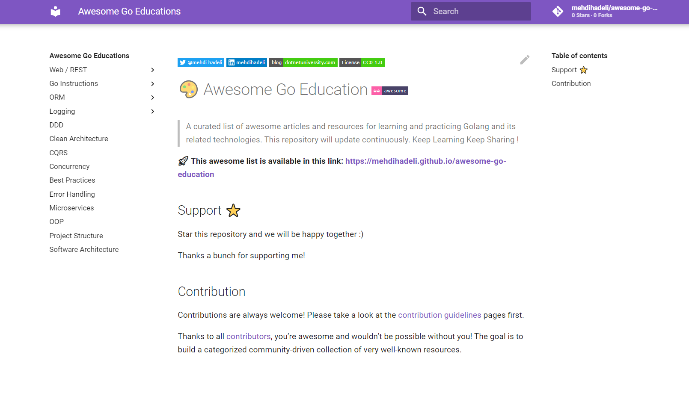

# 🎨 Awesome Go Education 
> A curated list of awesome articles and resources for learning and practicing Golang and its related technologies. This repository will update continuously. Keep Learning Keep Sharing !

I created this repository to share a set of links that I found valuable and inspiring and I share them with others to improve our knowledge together ✌️. 

**🚀 This awesome list is available in this link:**
**[https://mehdihadeli.github.io/awesome-go-education](https://mehdihadeli.github.io/awesome-go-education/)**

## 🙏 Special Thanks

Thanks to the authors of the links for their valuable content, I gather them in one place for finding topics to read easier.

## Support ⭐

Star this repository and we will be happy together :)

Thanks a bunch for supporting me!

## Contribution

Contributions are always welcome! Please take a look at the [contribution guidelines](https://github.com/mehdihadeli/awesome-go-education/blob/master/contributing.md) pages first.

Thanks to all [contributors](https://github.com/mehdihadeli/awesome-go-education/graphs/contributors), you're awesome and wouldn't be possible without you! The goal is to build a categorized community-driven collection of very well-known resources.

